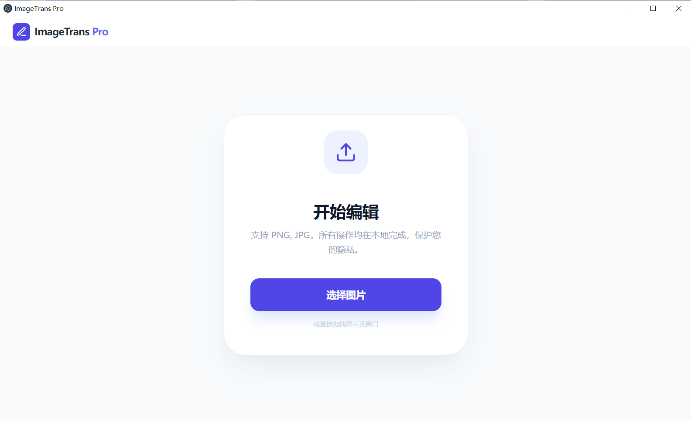
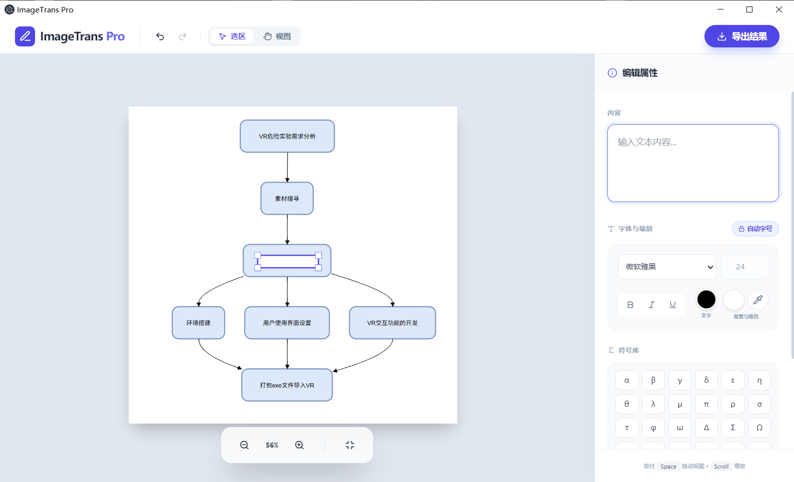

# ImageTrans Pro

A desktop application for overlaying translated text onto images. Draw annotation regions, add styled text, and export the result — all processed locally on your machine.


## Features

- **Image Upload** — Support PNG, JPG. Drag-and-drop or click to select.
- **Draw Annotations** — Click and drag to create text regions on the image.
- **Rich Text Styling** — Bold, italic, underline. Adjustable font family, size, and color.
- **Auto-fit Text** — Text automatically scales to fill the region (toggleable).
- **Color Picker** — Native EyeDropper API support with Canvas fallback for picking background colors.
- **Symbol Library** — Insert Greek letters, math symbols, currency signs, arrows, and more.
- **Undo/Redo** — Full history stack (50 steps). Ctrl+Z / Ctrl+Shift+Z.
- **Pan & Zoom** — Scroll to zoom, hold Space or middle-click to pan. Fit-to-screen button.
- **Export** — One-click export to PNG with all text rendered.
- **100% Local** — All processing happens on your machine. No data is ever uploaded.

## Screenshots





## Tech Stack

| Layer | Technology |
|-------|-----------|
| Desktop Shell | Electron 31 |
| UI Framework | React 18 |
| Styling | Tailwind CSS 3 |
| Icons | Lucide React |
| Build Tool | Vite 5 |
| Packaging | electron-builder |

## Installation

### Prerequisites

- [Node.js](https://nodejs.org/) >= 18
- npm (included with Node.js)

### Setup

```bash
# Clone the repository
git clone https://github.com/YOUR_USERNAME/imagetrans-pro.git
cd imagetrans-pro

# Install dependencies
npm install

# Start the application
npm start
```

### One-click Launch

After the first build, you can also:

- **Desktop shortcut** — Run `create-shortcut.ps1` in PowerShell to create a desktop shortcut that launches the app without a console window.
- **VBS launcher** — Double-click `launcher.vbs` in the project directory for a console-free launch.

## Usage

### Step 1: Upload an Image

Click **Select Image** or drag an image file onto the window.

### Step 2: Draw Annotation Regions

- Select the **Selection** tool in the toolbar.
- Click and drag on the image to create a text region.
- Click an existing region to select it.

### Step 3: Edit Text & Style

Once a region is selected, use the right panel to:

- **Content** — Type your translated text (supports multi-line).
- **Font** — Choose from 6 common fonts (Microsoft YaHei, SimHei, SimSun, KaiTi, Arial, Times New Roman).
- **Size** — Auto-scale (default) or manual font size.
- **Style** — Bold, italic, underline.
- **Colors** — Text color and background color. Use the eyedropper tool to sample colors from the image.
- **Symbols** — Insert Greek letters, math symbols, arrows, and more.

### Step 4: Export

Click **Export** in the top-right corner to download the annotated image as a PNG file.

### Keyboard Shortcuts

| Shortcut | Action |
|----------|--------|
| `Ctrl + Z` | Undo |
| `Ctrl + Shift + Z` | Redo |
| `Delete` / `Backspace` | Delete selected region |
| `Space` + drag | Pan view |
| `Scroll` | Zoom in/out |
| `Escape` | Exit color picker mode |

## Development

```bash
# Start Vite dev server with hot reload
npm run vite:dev

# Build frontend only
npm run build

# Build frontend and launch Electron
npm start
```

## Packaging

To create a Windows installer (.exe):

```bash
npm run dist
```

The installer will be generated in the `release/` directory.

> **Note for users in China**: The project is pre-configured with the npmmirror.com mirror for downloading Electron binaries. If you encounter network issues, ensure `ELECTRON_MIRROR` is set in your environment.

## Project Structure

```
imagetrans-pro/
├── electron/
│   ├── main.cjs          # Electron main process
│   └── preload.cjs       # Context bridge
├── src/
│   ├── App.jsx           # Main React component
│   ├── main.jsx          # React entry point
│   └── index.css         # Tailwind imports + global styles
├── dist/                 # Built frontend (generated)
├── release/              # Packaged installer (generated)
├── index.html            # HTML entry point
├── vite.config.js        # Vite configuration
├── tailwind.config.js    # Tailwind CSS configuration
├── create-shortcut.ps1   # PowerShell script to create desktop shortcut
├── launcher.vbs          # Console-free VBS launcher
├── package.json          # Project configuration
└── README.md
```

## FAQ

### Why does the app show a white screen?

Run `npm start` first to build the frontend. The app loads from `dist/index.html`. If that file is missing, Electron will show a blank page.

### Can I use this on macOS or Linux?

The app should work on macOS and Linux with the same codebase. For packaging:
- macOS: configure `build.mac.target` in `package.json`
- Linux: configure `build.linux.target` in `package.json`

### Why is the color picker not working?

The app first tries the native [EyeDropper API](https://developer.mozilla.org/en-US/docs/Web/API/EyeDropper). If unavailable, it falls back to canvas-based color sampling mode. Click the eyedropper icon, then click directly on the image.

## License

MIT License. See [LICENSE](LICENSE) for details.

## Contributing

Pull requests are welcome! For major changes, please open an issue first to discuss what you would like to change.
